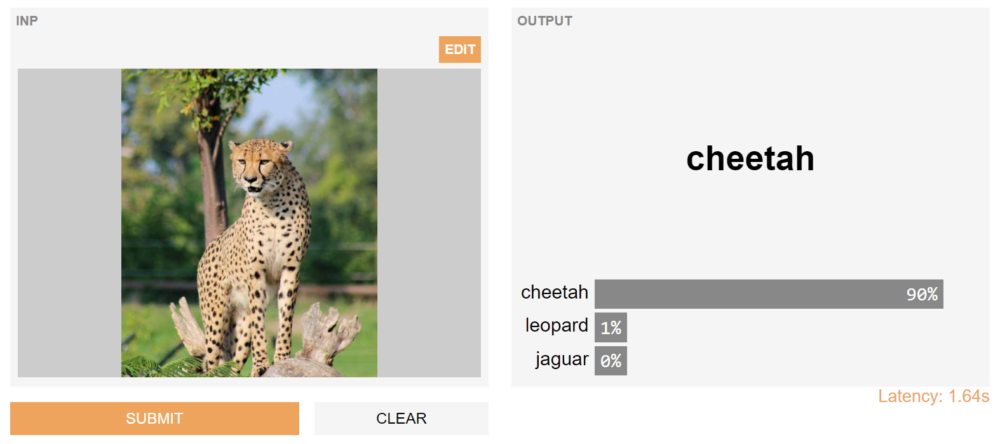

## MobileNet on Gradio
This repo contains code to launch a [Gradio](https://github.com/gradio-app/gradio) interface for MobileNet on [Gradio Hub](https://hub.gradio.app)

Credit to the awesome [Keras](https://github.com/keras-team/keras) library.

